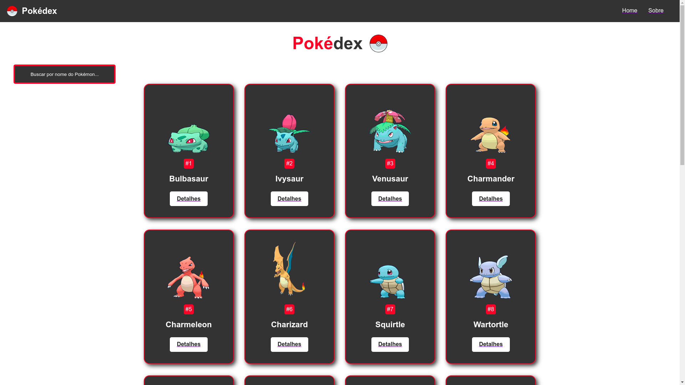
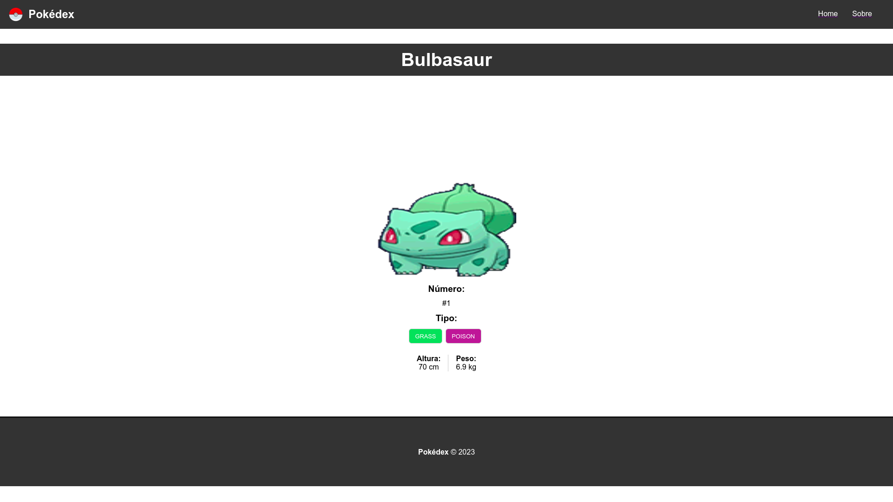
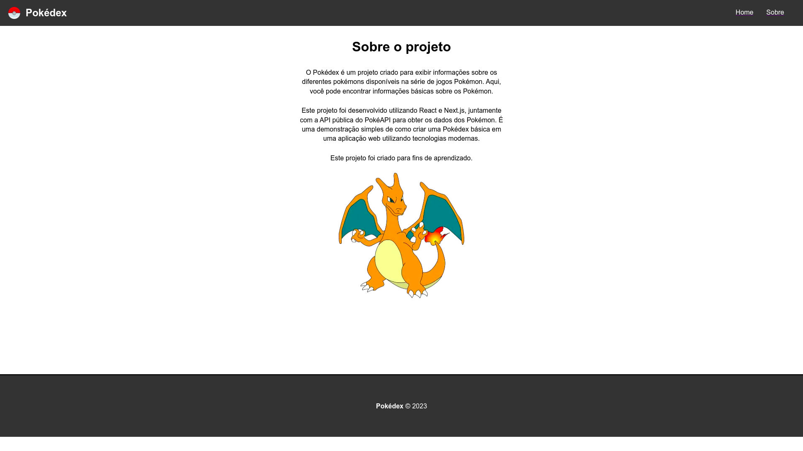

# Pokédex 

## Descrição

O Projeto Pokédex é uma aplicação web que exibe informações sobre diferentes Pokémon.

## Funcionalidades

- Exibição de informações sobre pokémons, como nome, tipo etc.
- Capacidade de buscar Pokémon pelo nome.
- Carregar mais Pokémon à medida que o usuário rola a página.

## Tecnologias Utilizadas

- React
- Next.js
- CSS Modules

## Layout

Home


<hr />

Detalhes


<hr />

Sobre


<hr />

 ## Demosntração

 ##### Link do projeto: https://pokedex-next-jt7t8hqqd-carolcampos22.vercel.app/

 <hr />

 ## Como rodar este projeto
 #### Pré-requisitos

- Node.js (versão 12 ou superior)
- npm (gerenciador de pacotes do Node.js)

#### Instalação

1. Clone este repositório para o seu computador:
```bash
git clone https://github.com/carolcampos22/pokedex-next
```
2. Acesse o diretório do projeto:
```bash
cd pokedex-next
```
3. Instale as dependências do projeto:
```bash
npm install
```

#### Uso
1. Inicie o servidor de desenvolvimento:
```bash
npm run dev
```
2. Abra o navegador e acesse `http://localhost:3000` para visualizar o Pokédex.


## Autora

<h4> Carolina M. Campos - Desenvolvedora Front-end</h4>

LinkedIn: https://www.linkedin.com/in/dev-carolina-mendes-campos/
